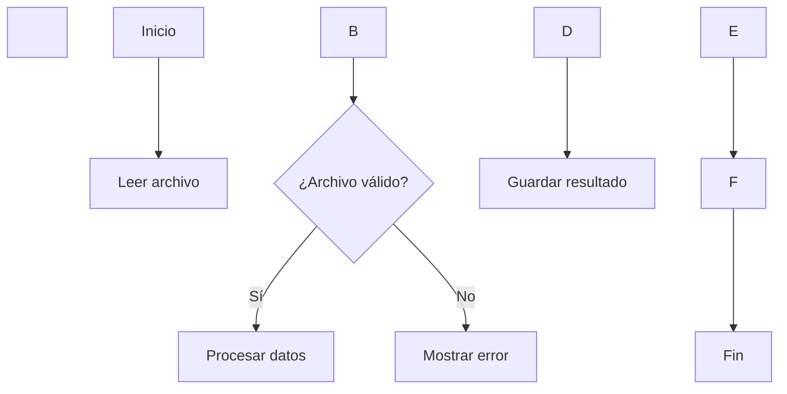

```mermaid

graph TD;

&nbsp;   A\[Inicio] --> B\[Leer archivo]

&nbsp;   B --> C{¿Archivo válido?}

&nbsp;   C -- Sí --> D\[Procesar datos]

&nbsp;   C -- No --> E\[Mostrar error]

&nbsp;   D --> F\[Guardar resultado]

&nbsp;   E --> F

&nbsp;   F --> G\[Fin]

```

