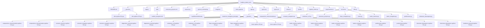

# Estructura del Proyecto

```mermaid
graph TD
A[Analitica_talento_tech]
._README.md["README.md"]
.___pycache__["__pycache__"]
.___pycache___utils.cpython-311.pyc["utils.cpython-311.pyc"]
.___pycache___utils.cpython-313.pyc["utils.cpython-313.pyc"]
._app.py["app.py"]
._data["data"]
._data_analisis_energetico.db["analisis_energetico.db"]
._estructura_proyecto.md["estructura_proyecto.md"]
._exponer.py["exponer.py"]
._generar_mermaid.py["generar_mermaid.py"]
._imagenes["imagenes"]
._imagenes_LogoBancolombia.png["LogoBancolombia.png"]
._imagenes_transicion_energetica_justa.jpeg["transicion_energetica_justa.jpeg"]
._iniciar_app.bat["iniciar_app.bat"]
._login.py["login.py"]
._ngrok.exe["ngrok.exe"]
._ngrok.yml["ngrok.yml"]
._notas.txt["notas.txt"]
._procfile["procfile"]
._registrar_token.py["registrar_token.py"]
._requirements.txt["requirements.txt"]
._secciones["secciones"]
._secciones___pycache__["__pycache__"]
._secciones___pycache___comparativos_internacionales.cpython-311.pyc["comparativos_internacionales.cpython-311.pyc"]
._secciones___pycache___comparativos_internacionales.cpython-313.pyc["comparativos_internacionales.cpython-313.pyc"]
._secciones___pycache___consumo_electrico.cpython-313.pyc["consumo_electrico.cpython-313.pyc"]
._secciones___pycache___consumo_energetico.cpython-311.pyc["consumo_energetico.cpython-311.pyc"]
._secciones___pycache___consumo_energetico.cpython-313.pyc["consumo_energetico.cpython-313.pyc"]
._secciones___pycache___diagnostico_nacional.cpython-311.pyc["diagnostico_nacional.cpython-311.pyc"]
._secciones___pycache___diagnostico_nacional.cpython-313.pyc["diagnostico_nacional.cpython-313.pyc"]
._secciones___pycache___emisiones_co2.cpython-311.pyc["emisiones_co2.cpython-311.pyc"]
._secciones___pycache___emisiones_co2.cpython-313.pyc["emisiones_co2.cpython-313.pyc"]
._secciones___pycache___flujos_energeticos.cpython-311.pyc["flujos_energeticos.cpython-311.pyc"]
._secciones___pycache___flujos_energeticos.cpython-313.pyc["flujos_energeticos.cpython-313.pyc"]
._secciones___pycache___home.cpython-311.pyc["home.cpython-311.pyc"]
._secciones___pycache___home.cpython-313.pyc["home.cpython-313.pyc"]
._secciones___pycache___matriz_electrica.cpython-311.pyc["matriz_electrica.cpython-311.pyc"]
._secciones___pycache___matriz_electrica.cpython-313.pyc["matriz_electrica.cpython-313.pyc"]
._secciones___pycache___matriz_energetica.cpython-311.pyc["matriz_energetica.cpython-311.pyc"]
._secciones___pycache___matriz_energetica.cpython-313.pyc["matriz_energetica.cpython-313.pyc"]
._secciones___pycache___predicciones.cpython-311.pyc["predicciones.cpython-311.pyc"]
._secciones___pycache___predicciones.cpython-313.pyc["predicciones.cpython-313.pyc"]
._secciones___pycache___relaciones_desempeno.cpython-311.pyc["relaciones_desempeno.cpython-311.pyc"]
._secciones___pycache___relaciones_desempeno.cpython-313.pyc["relaciones_desempeno.cpython-313.pyc"]
._secciones___pycache___tendencia_mensual.cpython-313.pyc["tendencia_mensual.cpython-313.pyc"]
._secciones_comparativos_internacionales.py["comparativos_internacionales.py"]
._secciones_consumo_energetico.py["consumo_energetico.py"]
._secciones_emisiones_co2.py["emisiones_co2.py"]
._secciones_estructura_proyecto.py["estructura_proyecto.py"]
._secciones_flujos_energeticos.py["flujos_energeticos.py"]
._secciones_home.py["home.py"]
._secciones_matriz_electrica.py["matriz_electrica.py"]
._secciones_matriz_energetica.py["matriz_energetica.py"]
._secciones_predicciones.py["predicciones.py"]
._secciones_relaciones_desempeno.py["relaciones_desempeno.py"]
._utils.py["utils.py"]
A[Analitica_talento_tech] --> ._app.py
A[Analitica_talento_tech] --> ._data
._data --> ._data_analisis_energetico.db
A[Analitica_talento_tech] --> ._estructura_proyecto.md
A[Analitica_talento_tech] --> ._exponer.py
A[Analitica_talento_tech] --> ._generar_mermaid.py
A[Analitica_talento_tech] --> ._imagenes
._imagenes --> ._imagenes_LogoBancolombia.png
._imagenes --> ._imagenes_transicion_energetica_justa.jpeg
A[Analitica_talento_tech] --> ._iniciar_app.bat
A[Analitica_talento_tech] --> ._login.py
A[Analitica_talento_tech] --> ._ngrok.exe
A[Analitica_talento_tech] --> ._ngrok.yml
A[Analitica_talento_tech] --> ._notas.txt
A[Analitica_talento_tech] --> ._procfile
A[Analitica_talento_tech] --> ._README.md
A[Analitica_talento_tech] --> ._registrar_token.py
A[Analitica_talento_tech] --> ._requirements.txt
A[Analitica_talento_tech] --> ._secciones
._secciones --> ._secciones_comparativos_internacionales.py
._secciones --> ._secciones_consumo_energetico.py
._secciones --> ._secciones_emisiones_co2.py
._secciones --> ._secciones_estructura_proyecto.py
._secciones --> ._secciones_flujos_energeticos.py
._secciones --> ._secciones_home.py
._secciones --> ._secciones_matriz_electrica.py
._secciones --> ._secciones_matriz_energetica.py
._secciones --> ._secciones_predicciones.py
._secciones --> ._secciones_relaciones_desempeno.py
._secciones --> ._secciones___pycache__
._secciones___pycache__ --> ._secciones___pycache___comparativos_internacionales.cpython-311.pyc
._secciones___pycache__ --> ._secciones___pycache___comparativos_internacionales.cpython-313.pyc
._secciones___pycache__ --> ._secciones___pycache___consumo_electrico.cpython-313.pyc
._secciones___pycache__ --> ._secciones___pycache___consumo_energetico.cpython-311.pyc
._secciones___pycache__ --> ._secciones___pycache___consumo_energetico.cpython-313.pyc
._secciones___pycache__ --> ._secciones___pycache___diagnostico_nacional.cpython-311.pyc
._secciones___pycache__ --> ._secciones___pycache___diagnostico_nacional.cpython-313.pyc
._secciones___pycache__ --> ._secciones___pycache___emisiones_co2.cpython-311.pyc
._secciones___pycache__ --> ._secciones___pycache___emisiones_co2.cpython-313.pyc
._secciones___pycache__ --> ._secciones___pycache___flujos_energeticos.cpython-311.pyc
._secciones___pycache__ --> ._secciones___pycache___flujos_energeticos.cpython-313.pyc
._secciones___pycache__ --> ._secciones___pycache___home.cpython-311.pyc
._secciones___pycache__ --> ._secciones___pycache___home.cpython-313.pyc
._secciones___pycache__ --> ._secciones___pycache___matriz_electrica.cpython-311.pyc
._secciones___pycache__ --> ._secciones___pycache___matriz_electrica.cpython-313.pyc
._secciones___pycache__ --> ._secciones___pycache___matriz_energetica.cpython-311.pyc
._secciones___pycache__ --> ._secciones___pycache___matriz_energetica.cpython-313.pyc
._secciones___pycache__ --> ._secciones___pycache___predicciones.cpython-311.pyc
._secciones___pycache__ --> ._secciones___pycache___predicciones.cpython-313.pyc
._secciones___pycache__ --> ._secciones___pycache___relaciones_desempeno.cpython-311.pyc
._secciones___pycache__ --> ._secciones___pycache___relaciones_desempeno.cpython-313.pyc
._secciones___pycache__ --> ._secciones___pycache___tendencia_mensual.cpython-313.pyc
A[Analitica_talento_tech] --> ._utils.py
A[Analitica_talento_tech] --> .___pycache__
.___pycache__ --> .___pycache___utils.cpython-311.pyc
.___pycache__ --> .___pycache___utils.cpython-313.pyc
```